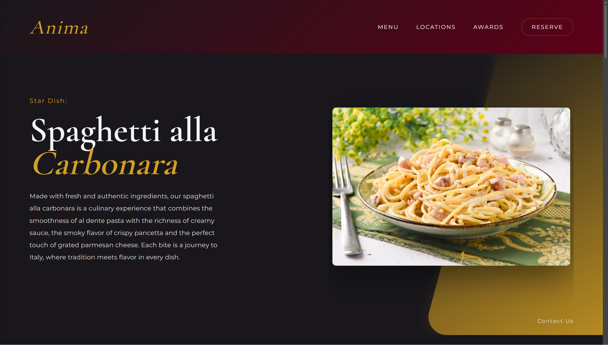
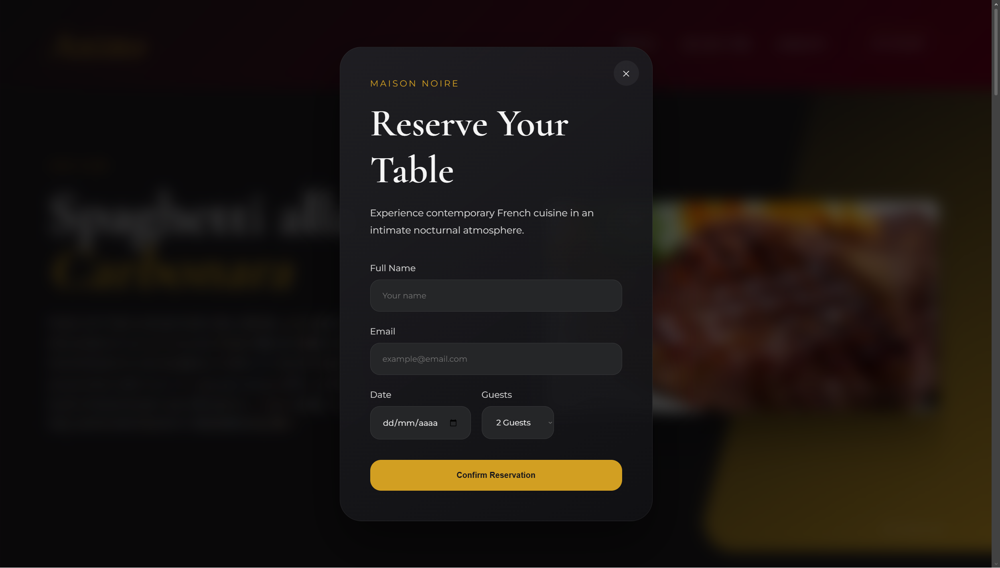

# Anima — Luxury Restaurant Landing Page

Anima is a modern luxury restaurant landing page inspired by contemporary French fine dining, immersive nightlife atmosphere, and elegant editorial UI design.

This project was created as a front-end portfolio piece focused on:

- Advanced UI composition
- Premium visual identity
- Responsive layouts
- Modern CSS architecture
- Smooth interactions & transitions
- Atmospheric presentation design

---

# Preview



Anima combines:

- Dark luxury aesthetic
- Gold & crimson palette
- Cinematic gradients
- Animated hero slideshow
- Glassmorphism surfaces
- Responsive gourmet menu
- Reservation modal
- Awards & locations sections
- Smooth navigation experience

---

# Features

## Hero Section
- Animated dish slideshow
- Layered gradients
- Elegant typography
- Responsive composition

## Menu Section
- Gourmet dish cards
- Hover animations
- Responsive grid system
- Soft masked food imagery

## About / Locations
- Brand story section
- International restaurant locations
- Cinematic image layout

## Awards Section
- Luxury presentation cards
- Glassmorphism effects
- Interactive hover states

## Reservation Modal
- Fully styled reservation form
- Smooth open/close animations
- Responsive modal system

## Footer
- Multi-column layout
- Navigation & social links
- Responsive structure

## Extra
- Back-to-top floating button
- CSS variable system
- Fully responsive design

---

# Tech Stack

- HTML5
- CSS3
- Vanilla JavaScript

No frameworks or external libraries were used.

---

# Design Goals

This project focuses heavily on visual hierarchy and luxury branding principles:

- Editorial inspired layouts
- Minimal but atmospheric interfaces
- Elegant spacing systems
- Sophisticated typography
- Cinematic color palette

---

# Color Palette

| Color | Hex |
|---|---|
| Background | `#19171b` |
| Gold Accent | `#d29f22` |
| Crimson Accent | `#5d0018` |
| Surface | `#252628` |
| Text | `#f5f5f5` |

---

# Responsive Design

The website is optimized for:

- Desktop
- Tablets
- Mobile devices

Responsive breakpoints were handcrafted without frameworks.

---

# Folder Structure

```bash
project/
│
├── index.html
├── style.css
├── script.js
└── README.md
